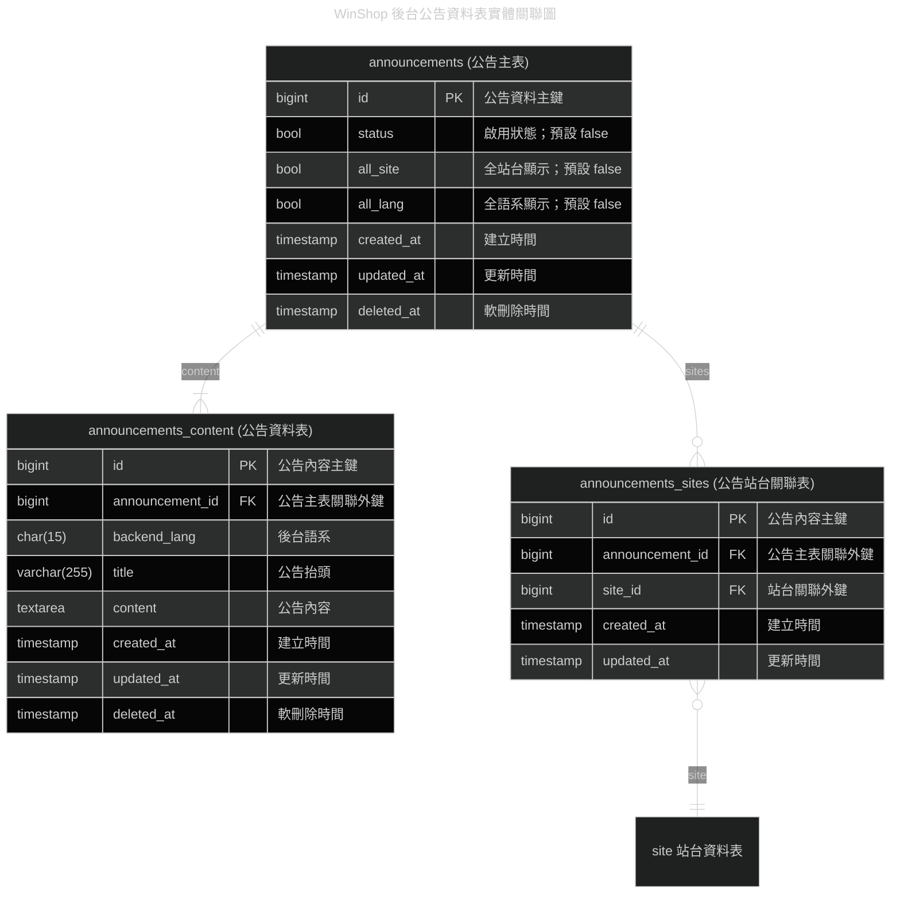

# 資料庫設計

### 後台公告資料表 ERD

<figure><figcaption></figcaption></figure>

```mermaid
---
title: WinShop 後台公告資料表實體關聯圖
config:
    theme: dark
    darkMode: true
---
erDiagram
    main ||--|{ content : content
    main ||--o{ sites : sites
    sites o{--|| site : site
    main["announcements (公告主表)"] {
        bigint id PK "公告資料主鍵"
        bool status "啟用狀態；預設 false"
        bool all_site "全站台顯示；預設 false"
        bool all_lang "全語系顯示；預設 false"
        timestamp created_at "建立時間"
        timestamp updated_at "更新時間"
        timestamp deleted_at "軟刪除時間"
        %% 組合欄位索引：[status, all_site, all_lang]
    }
    content["announcements_content (公告資料表)"] {
        bigint id PK "公告內容主鍵"
        bigint announcement_id FK "公告主表關聯外鍵"
        char(15) backend_lang "後台語系"
        varchar(255) title "公告抬頭"
        textarea content "公告內容"
        timestamp created_at "建立時間"
        timestamp updated_at "更新時間"
        timestamp deleted_at "軟刪除時間"
        %% 單一欄位索引欄位：backend_lang
    }
    sites["announcements_sites (公告站台關聯表)"] {
        bigint id PK "公告內容主鍵"
        bigint announcement_id FK "公告主表關聯外鍵"
        bigint site_id FK "站台關聯外鍵"
        timestamp created_at "建立時間"
        timestamp updated_at "更新時間"
        %% 單一欄位索引欄位：site_id
    }
    site["site 站台資料表"]
```

