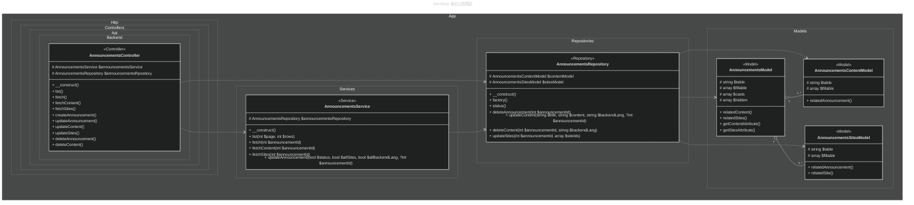

# 顯示、管理 API 類圖

<figure><figcaption></figcaption></figure>

```mermaid
---
title: WinShop 後台公告類圖
config:
  theme: dark
  darkMode: true
---
classDiagram
    AnnouncementsController ..> AnnouncementsService
    AnnouncementsController ..> AnnouncementsRepository
    AnnouncementsService ..> AnnouncementsRepository
    AnnouncementsRepository ..> AnnouncementsModel
    AnnouncementsRepository ..> AnnouncementsContentModel
    AnnouncementsRepository ..> AnnouncementsSitesModel
    AnnouncementsModel "1" o-- "1..*" AnnouncementsContentModel
    AnnouncementsModel "1" o-- "0..*" AnnouncementsSitesModel
    namespace App.Http.Controllers.Api.Backend {
        class AnnouncementsController {
            <<Controller>>
            # AnnouncementsService $announcementsService
            # AnnouncementsRepository $announcementsRpository
            + __construct()
            + list()
            + fetch()
            + fetchContent()
            + fetchSites()
            + createAnnouncement()
            + updateAnnouncement()
            + updateContent()
            + updateSites()
            + deleteAnnouncement()
            + deleteContent()
        }
    }
    namespace App.Services {
        class AnnouncementsService {
            <<Service>>
            # AnnouncementsRepository $announcementsRepository
            + __construct()
            + list(int $page, int $rows)
            + fetch(int $announcementId)
            + fetchContent(int $announcementId)
            + fetchSites(int $announcementId)
            + updateAnnouncement(bool $status, bool $allSites, bool $allBackendLang, ?int $announcementId)
        }
    }
    namespace App.Repositories {
        class AnnouncementsRepository {
            <<Repository>>
            # AnnouncementsContentModel $contentModel
            # AnnouncementsSitesModel $sitesModel
            + __construct()
            + factory()
            + status()
            + deleteAnnouncement(int $announcementId)
            + updateContent(string $title, string $content, string $backendLang, ?int $announcementId)
            + deleteContent(int $announcementId, string $backendLang)
            + updateSites(int $announcementId, array $siteIds)
        }
    }
    namespace App.Models {
        class AnnouncementsModel {
            <<Model>>
            # string $table
            # array $fillable
            # array $casts
            # array $hidden
            + relatedContent()
            + relatedSites()
            + getContentAttribute()
            + getSitesAttribute()
        }
        class AnnouncementsContentModel {
            <<Model>>
            # string $table
            # array $fillable
            + relatedAnnouncement()
        }
        class AnnouncementsSitesModel {
            <<Model>>
            # string $table
            # array $fillable
            + relatedAnnouncement()
            + relatedSite()
        }
    }
```
