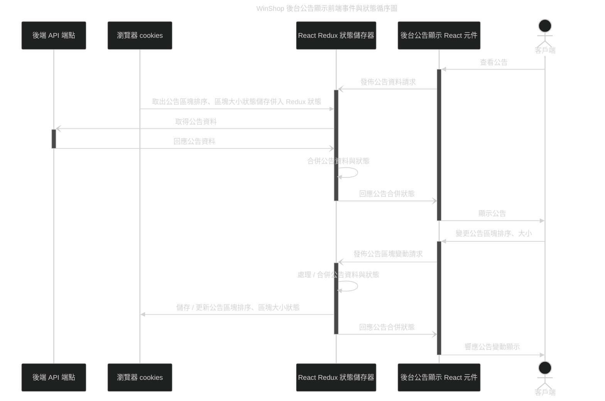
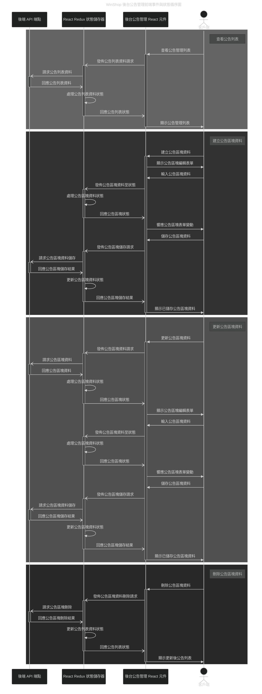

# 前端事件、狀態循序圖

<figure><figcaption></figcaption></figure>

```mermaid
---
title: WinShop 後台公告顯示前端事件與狀態循序圖
config:
  theme: dark
  darkMode: true
---
sequenceDiagram
    participant backend as 後端 API 端點
    participant cookies as 瀏覽器 cookies
    participant redux as React Redux 狀態儲存器
    participant announcement as 後台公告顯示 React 元件
    actor client as 客戶端
    client ->>+ announcement: 查看公告
    announcement -)+ redux: 發佈公告資料請求
    cookies ->> redux: 取出公告區塊排序、區塊大小狀態儲存併入 Redux 狀態
    redux -)+ backend: 取得公告資料
    backend -)- redux: 回應公告資料
    redux ->> redux: 合併公告資料與狀態
    redux -)- announcement: 回應公告合併狀態
    announcement ->>- client: 顯示公告
    client ->>+ announcement: 變更公告區塊排序、大小
    announcement -)+ redux: 發佈公告區塊變動請求
    redux ->> redux: 處理 / 合併公告資料與狀態
    redux ->> cookies: 儲存 / 更新公告區塊排序、區塊大小狀態
    redux -)- announcement: 回應公告合併狀態
    announcement ->>- client: 響應公告變動顯示
```

***

<figure><figcaption></figcaption></figure>

```mermaid
---
title: WinShop 後台公告管理前端事件與狀態循序圖
config:
  theme: dark
  darkMode: true
---
sequenceDiagram
    participant backend as 後端 API 端點
    participant redux as React Redux 狀態儲存器
    participant announcementManage as 後台公告管理 React 元件
    actor client as 客戶端
    rect rgb(100, 100, 100)
    note right of client: 查看公告列表
    client ->>+ announcementManage: 查看公告管理列表
    announcementManage -)+ redux: 發佈公告列表資料請求
    redux -)+ backend: 請求公告列表資料
    backend -)- redux: 回應公告列表資料
    redux ->> redux: 處理公告列表資料狀態
    redux -)- announcementManage: 回應公告列表狀態
    announcementManage ->>- client: 顯示公告管理列表
    end
    rect rgb(50, 50, 50)
    note right of client: 建立公告區塊資料
    client ->>+ announcementManage: 建立公告區塊資料
    announcementManage ->> client: 顯示公告區塊編輯表單
    client ->> announcementManage: 輸入公告區塊資料
    announcementManage -)+ redux: 發佈公告區塊資料至狀態
    redux ->> redux: 處理公告區塊資料狀態
    redux -)- announcementManage: 回應公告區塊狀態
    announcementManage ->> client: 響應公告區塊表單變動
    client ->> announcementManage: 儲存公告區塊資料
    announcementManage -)+ redux: 發佈公告區塊儲存請求
    redux -)+ backend: 請求公告區塊資料儲存
    backend -)- redux: 回應公告區塊儲存結果
    redux ->> redux: 更新公告區塊資料狀態
    redux -)- announcementManage: 回應公告區塊儲存結果
    announcementManage ->>- client: 顯示已儲存公告區塊資料
    end
    rect rgb(80, 80, 80)
    note right of client: 更新公告區塊資料
    client ->>+ announcementManage: 更新公告區塊資料
    announcementManage -)+ redux: 發佈公告區塊資料請求
    redux -)+ backend: 請求公告區塊資料
    backend -)- redux: 回應公告區塊資料
    redux ->> redux: 處理公告區塊資料狀態
    redux -)- announcementManage: 回應公告區塊狀態
    announcementManage ->> client: 顯示公告區塊編輯表單
    client ->> announcementManage: 輸入公告區塊資料
    announcementManage -)+ redux: 發佈公告區塊資料至狀態
    redux ->> redux: 處理公告區塊資料狀態
    redux -)- announcementManage: 回應公告區塊狀態
    announcementManage ->> client: 響應公告區塊表單變動
    client ->> announcementManage: 儲存公告區塊資料
    announcementManage -)+ redux: 發佈公告區塊儲存請求
    redux -)+ backend: 請求公告區塊資料儲存
    backend -)- redux: 回應公告區塊儲存結果
    redux ->> redux: 更新公告區塊資料狀態
    redux -)- announcementManage: 回應公告區塊儲存結果
    announcementManage ->>- client: 顯示已儲存公告區塊資料
    end
    rect rgb(40, 40, 40)
    note right of client: 刪除公告區塊資料
    client ->>+ announcementManage: 刪除公告區塊資料
    announcementManage -)+ redux: 發佈公告區塊資料刪除請求
    redux -)+ backend: 請求公告區塊刪除
    backend -)- redux: 回應公告區塊刪除結果
    redux ->> redux: 更新公告列表資料狀態
    redux -)- announcementManage: 回應公告列表狀態
    announcementManage ->>- client: 顯示更新後公告列表
    end
```
